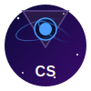

<div align="center">
  
  <h1>Cosmic Sentinel</h1>
  <p>
    
    
    
  </p>
</div>

A comprehensive space observation and monitoring platform for astronomers and space enthusiasts.

[Project Plan & Roadmap](PROJECT.md) | [Features](#features) | [Installation](#installation) | [Usage](#usage) | [Story](#project-story)

## Why This Software Matters

Cosmic Sentinel isn't just a space tracker - it's a powerful AI-enhanced observatory at your fingertips.
Whether you're a hobbyist looking at the night sky or a researcher analyzing space data, this app brings the universe to your desktop.

> Check out our detailed [Project Plan](PROJECT.md) for current status, roadmap, and future enhancements.

## Features

- **Planetary Tracking**: Track and visualize planetary positions and movements
- **Asteroid Monitoring**: Monitor near-Earth objects and potentially hazardous asteroids
- **Space Weather Monitor**: Track solar activity, geomagnetic conditions, and aurora forecasts with AI-powered flare prediction
- **Reporting**: Generate detailed reports and visualizations

## Installation

1. Clone the repository:
   ```
   git clone https://github.com/yourusername/cosmic-sentinel.git
   cd cosmic-sentinel
   ```

2. Install dependencies:
   ```
   pip install -r requirements.txt
   ```

3. Configure API keys:
   - Create an account at [NASA API Portal](https://api.nasa.gov/) to get an API key
   - Either add your API key to `config.ini` or enter it in the application settings

## Configuration

The application can be configured through:

1. The `config.ini` file in the root directory
2. The application settings dialog
3. Command-line arguments

### Space Weather Monitor Configuration

Space weather monitoring can be configured with the following settings:
```ini
[space_weather]
monitoring_interval = 3600        # Update interval in seconds
auto_start_monitoring = false     # Start monitoring automatically
cache_expiration = 1              # Cache expiration in hours
solar_flare_alerts = true         # Enable solar flare alerts
cme_alerts = true                 # Enable CME alerts
geomagnetic_storm_alerts = true   # Enable geomagnetic storm alerts
aurora_alerts = true              # Enable aurora alerts
minimum_alert_severity = MODERATE # Minimum severity for alerts
use_ml_prediction = true          # Enable ML-based solar flare prediction
prediction_confidence = 0.7       # Minimum confidence threshold for predictions
prediction_hours = 24             # Hours ahead to predict flares
```
```

## Usage

Run the application:
```
python main.py
```

## Project Story

### Why I Created This Project

I have been an amateur astronomer since childhood. I still remember the amazement I felt when first viewing the night sky.
As a software developer, I naturally became interested in combining my love of astronomy with my computer programming skills.

In 2020, I started to learn about formulas for calculating positions of the Moon and planets. I discovered many wonderful resources, including:
- Paul Schlyter's lucid and educational page [How to compute planetary positions](http://www.stjarnhimlen.se/comp/ppcomp.html)
- [Practical Astronomy with your Calculator](https://www.amazon.com/Practical-Astronomy-Calculator-Peter-Duffett-Smith/dp/0521356997), third edition, by Peter Duffett-Smith, Cambridge University Press
- [Astronomy on the Personal Computer](https://www.amazon.com/Astronomy-Personal-Computer-Oliver-Montenbruck/dp/3540672214/) by Oliver Montenbruck and Thomas Pfleger

## Technical Details

Cosmic Sentinel employs a modern, distributed architecture designed to handle astronomical data processing efficiently while maintaining high availability and scalability.

### Architecture Overview

The system is built on an event-driven microservices architecture with the following components:

- **Core Analysis Engine**: Python-based computational backend using NumPy and SciPy for celestial mechanics
- **Observation Service**: Manages telescope interfaces and sensor data collection
- **Data Pipeline**: Apache Kafka streams for real-time astronomical event processing
- **Persistence Layer**: Time-series database (InfluxDB) with PostgreSQL for relational data
- **User Interface**: Qt-based desktop application with WebGL visualizations
- **Alert System**: Pub/sub notification service for astronomical events of interest

This decoupled approach allows components to scale independently and facilitates continuous deployment without system-wide downtime.

### Technology Stack Selection

Our stack combines proven technologies with cutting-edge tools optimized for astronomical data:

- **Python 3.11+**: Core computational engine with asyncio for non-blocking I/O
- **C++ Acceleration**: Critical path algorithms implemented in C++ via Cython for performance
- **Qt Framework**: Cross-platform UI with hardware-accelerated data visualization
- **gRPC**: High-performance RPC framework for service communication
- **Redis**: In-memory caching for ephemeris data and frequent calculations
- **Docker/Kubernetes**: Containerization and orchestration for development and deployment
- **Space Data Integration**

Cosmic Sentinel integrates with multiple space agency APIs and data sources:

- **JPL HORIZONS System**: High-precision ephemerides for solar system objects
- **NASA DONKI**: Space weather forecasting and solar event monitoring
- **ESA Space Situational Awareness**: Near-Earth object and debris tracking
- **NOAA SWPC**: Geomagnetic storm predictions and space weather alerts
- **Minor Planet Center**: Asteroid and comet observational data
- **Gaia DR3**: Star catalog and reference frame data
- **GOES X-ray Flux**: Real-time solar X-ray data for flare prediction
- **Gaia DR3**: Star catalog and reference frame data

These integrations use a unified adapter pattern with exponential backoff for reliable data acquisition.

### Performance Optimization Strategies

Working with massive astronomical datasets presents unique challenges:

- **Lazy Loading**: On-demand computation of planetary positions
- **Spatial Indexing**: R-tree structures for efficient celestial object queries
- **Calculation Memoization**: Caching intermediate results for ephemeris calculations
- **Parallel Processing**: Multi-threaded analysis for CPU-intensive operations
- **GPU Acceleration**: CUDA-based computation for n-body simulations and visualization
- **Data Downsampling**: Adaptive resolution based on zoom level and processing needs

### Real-time Processing Challenges

The system addresses several real-time processing challenges:

- **Time Synchronization**: Precise timing across distributed components using NTP with PTP fallback
- **Anomaly Detection**: Statistical models to identify unusual celestial phenomena
- **Latency Management**: Prioritization queue for time-critical alerts (e.g., NEO approaches)
- **Backpressure Handling**: Rate limiting and buffering for data surge management
- **Fault Tolerance**: Circuit breakers to handle API failures gracefully
- **Deep Learning Inference**: Optimized CNN-LSTM models for real-time solar flare prediction

Our architecture balances theoretical accuracy with practical performance needs, focusing on delivering actionable astronomical intelligence while maintaining sub-second response times for interactive visualizations.

## Support and Contribution

I am committed to maintaining this project for the long term, and I am happy to
answer questions about how to solve various astronomy calculation problems
using Cosmic Sentinel. Feel free to reach out on the
[discussions page](https://github.com/A5873/Cosmic-Sentinel/discussions) or
[submit a new issue](https://github.com/A5873/Cosmic-Sentinel/issues).

## License

This project is licensed under the MIT License - see the LICENSE file for details.

---

<div align="center">
  
  <p>Cosmic Sentinel &copy; 2025</p>
</div>
